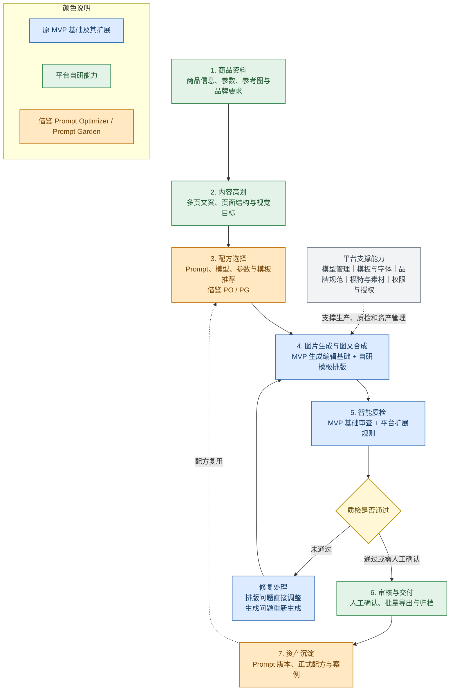

# AI 商品图文内容生产与智能质检平台总体方案

## 1. 项目基础

现有 `image_qa_mvp` 已经跑通图片生成、自动审查和结果修复的基本流程。

目前可以完成：

- 根据文字要求生成或修改图片；
- 进行商品替换和已有图片审查；
- 自动理解需要保留、删除和重点检查的内容；
- 结合参考图、OCR 和视觉信息审查生成结果；
- 对多张候选图片进行排序；
- 对不合格结果进行一轮自动修复。

现有 MVP 解决了“图片生成后如何自动检查”的问题，可以作为后续平台的生成与质检基础。但它还没有覆盖商品资料、文案策划、模板排版、批量生产和生成方法沉淀等完整业务流程。

> 讲解参考：现有 MVP 已经验证了生成和质检闭环，下一步是在此基础上扩展成完整的商品内容生产平台。

## 2. 外部项目参考

| 参考项目 | 项目特点 | 可借鉴内容 |
|---|---|---|
| [Prompt Optimizer](https://github.com/linshenkx/prompt-optimizer) | 对 Prompt 进行优化、测试、版本管理和多模型比较 | Prompt 变量、版本管理、生成效果对比和优化流程 |
| [Prompt Garden](https://garden.always200.com/) | 通过分类、标签和示例展示可复用的 Prompt | 内部案例库、配方分类、示例展示和一键套用方式 |

两个项目主要作为产品设计参考。本平台不会直接照搬通用 Prompt 工具或公开 Prompt 社区，而是将相关能力改造成适合商品内容生产的内部功能。

> 讲解参考：Prompt Optimizer 解决生成方法如何管理，Prompt Garden 解决优秀方法如何展示和复用。

## 3. 整体 IP 能力架构

平台按照商品内容的实际生产顺序划分为七个阶段。主流程从商品资料开始，经过策划、生成、质检和交付，最后将验证有效的方法沉淀为配方；质检未通过时返回生产环节修复，已发布配方则进入下一次任务复用。

### 3.1 商品资料与内容策划

统一管理商品信息、卖点、参数、品牌要求和参考素材，形成结构化商品档案；在生成图片前完成多页内容规划，确定每一页的主题、文案层级、页面类型和视觉要求。（对应原来的文描多图生成的需求。）

### 3.2 Prompt 与生成配方

根据商品品类、品牌定位和页面类型推荐生成配方。配方由 Prompt、模型参数、模板和质检规则组成；其中 Prompt 的变量、版本和实验方式借鉴 Prompt Optimizer，配方的分类、案例和复用方式借鉴 Prompt Garden。做到简单配置参数，提供参考图就可以快速生成目标图片。

### 3.3 图片生成与图文合成

图片和文案可以并行生成。图片侧复用现有 MVP 的文生图、商品替换和图片编辑能力，并扩展商品场景和模特应用；文字侧通过模板和排版引擎完成合成，保证文字准确、字体可控和多页版式一致。

### 3.4 智能质检与修复

现有 MVP 已具备 OCR 检查、商品参考一致性、目标及非目标区域变化检测、基础版式判断、多候选排序和一轮重新生成修复。平台进一步补充模板安全区、文字遮挡、商品事实、正式品牌规范、多页一致性和品类专项检查。

文字位置、字号、颜色和边距等问题由排版引擎直接调整；商品变形、场景错误或人物异常等问题补充约束后重新生成。需要人工判断的结果进入审核环节。

### 3.5 交付与资产沉淀

审核通过后支持整套内容批量导出，并保存生成结果、质检结论和实验记录。验证有效的 Prompt 版本发布为正式生成配方，进入内部配方库，供同系列商品和后续任务直接复用。

> 讲解参考：可从上到下说明主生产链路，再重点介绍两条回流路径——不合格结果返回修复，合格方案进入配方库持续复用。颜色用于区分原 MVP、自研扩展和两个参考项目的借鉴能力。

## 4. 使用方式

以一个新品详情页为例：

1. 用户上传产品图片、产品名称、卖点和品牌要求。
2. 系统生成主视觉、卖点、场景和参数等页面规划。
3. 系统推荐合适的生成配方和模板。
4. 图片模型生成候选底图，排版引擎完成文字合成。
5. 智能质检检查商品、文字、遮挡和版式问题。
6. 系统自动调整简单问题，并对候选结果进行排序。
7. 用户确认后整套导出，效果好的方案保存为正式配方。

同系列商品可以直接复用已有配方，只替换商品资料和图片，从而支持批量生产。

> 讲解参考：用户操作保持简单，复杂的 Prompt、模型和质检逻辑都在平台后台完成。

## 5. 建设路径

首期计划用 4—8 周完成一条可试用的核心流程。

| 阶段 | 主要内容 | 结果 |
|---|---|---|
| 第一阶段 | 商品资料、文案规划、基础生图 | 能根据商品资料生成多页内容 |
| 第二阶段 | 模板排版、智能质检、自动修复 | 能生成版式统一并经过检查的商品图 |
| 第三阶段 | Prompt 版本、生成配方、内部案例库 | 能保存和复用已经验证的生成方法 |

首期可以先选择一个重点品类和 3—5 个模板进行验证，后续再扩展更多品类、模板、模特和品牌规则。

> 讲解参考：首期重点是跑通完整流程，不追求一次覆盖所有品类和功能。

## 6. 方案价值

平台最终沉淀的不只是生成图片，还包括商品资料结构、内容规划方式、页面模板、质检规则和经过验证的生成配方。

这些资产会随着使用持续积累，形成一套可批量生产、可自动检查、可重复使用并能够不断优化的商品内容生产体系。

> 讲解参考：平台的核心 IP 不是某一个图片模型，而是完整生产流程以及长期积累的模板、规则、案例和配方。
